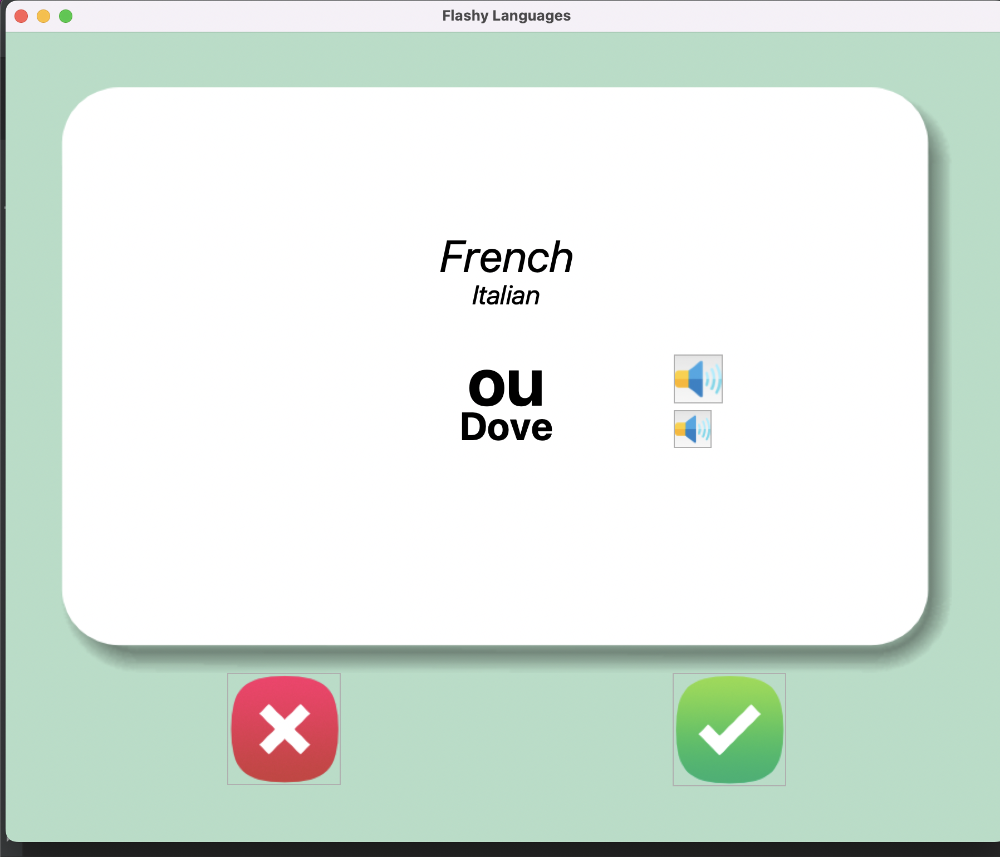
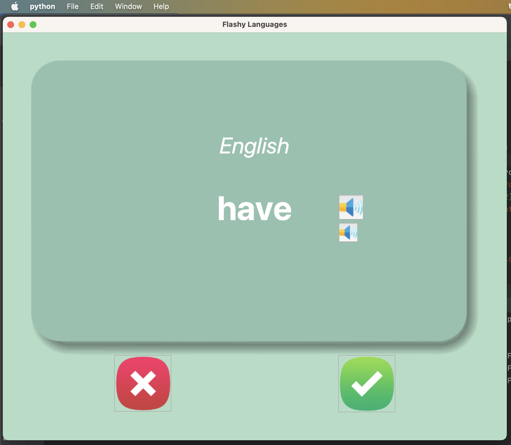

# Speedy Learn Two new languages at same time

>  Project with a goal to help self learners(autodidact) that want to speed up and train their brain to learn two new languages at same time. We use audio and visual stimulation.

Steps to accomplish this goal:

- [x] UI with Tkinter;
- [x] Create .csv data file to use as DB for this project;
- [x]Implement Speech libray to the user be able to listen to any new word ;
- [x] Flip the card in specific time.
- [x] Save the progress of the user

Tech Implemented & Prints: 
-----------
1. Phyton
   * Tkinter 
   

> Prints Screen of this App for MacOS:

[]
Gabe Pereira Coding :white_check_mark:
:snake:
